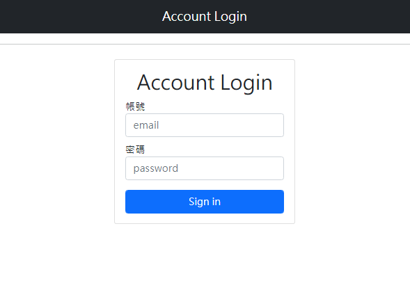

# loginv2
<h3>簡介</h3>

這是運用express和mongoose做成的簡易登入系統

<h3>測試帳號</h3>
 
   firstName: 'Tony',
   email: 'tony@stark.com',
   password: 'iamironman'
 
 
   firstName: 'Steve',
   email: 'captain@hotmail.com',
   password: 'icandothisallday'
 
 
   firstName: 'Peter',
   email: 'peter@parker.com',
   password: 'enajyram'
 
 
   firstName: 'Natasha',
   email: 'natasha@gamil.com',
   password: '*parol#@$!'
 
 
   firstName: 'Nick',
   email: 'nick@shield.com',
   password: 'password'
 

<h3>下載方法</h3>
<ol>
  <li>點擊code複製本專案網址https://github.com/extrem9713/login_excercise.git</li>
  <li>使用terminal複製本專案: git clone https://github.com/extrem9713/login_excercise.git</li>
  <li>使用terminal進入存放資料的資料夾: cd login_excercise</li>
  <li>使用terminal安裝npm: npm install</li>
  <li>使用terminal加入種子資料: npm run seed</li>
  <li>使用terminal安裝nodemon: npm install nodemon</li>
  <li>使用terminal: npm run dev</li>
  <li>開啟網頁 http://localhost:3000</li>
</ol>

<h3>首頁</h3>

 
<h3>使用工具</h3>
<ul>
  <li>Visual Studio Code</li>
  <li>Express(version:4.17.1)</li>
  <li>Express-handlebars(version:5.3.2)</li>
  <li>mongoose(version:5.13.2)</li>
  <li>npm</li>
  <li>nodemon</li>
</ul>
